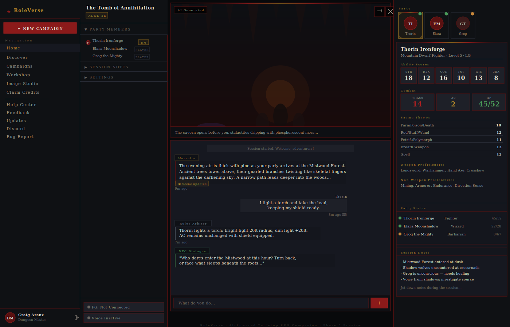

#  RoleVerse - AI-Powered RPG Companion

A tabletop RPG companion that brings **AI-powered DM assistance**, **Fantasy Grounds integration**, and **voice-enabled gameplay** to your solo RPG campaigns.

## 🖥️ Demo

### Web App
The three-column session layout with sidebar navigation, AI chat with scene display, and character sheet panel.

### Fantasy Grounds Integration
Real-time sync with Fantasy Grounds Unity — combat tracker, character sheets, dice rolls, and battle maps flow seamlessly to the web app.

> [Fantasy Grounds Unity](https://www.fantasygrounds.com) is a virtual tabletop by SmiteWorks. RoleVerse syncs character data, combat state, and dice rolls in real time via a local bridge application.

### Discord Integration
Voice chat via Discord is transcribed and displayed in the web app chat. The RoleVerse Bot relays AI agent responses as rich embeds.

> [Discord](https://discord.com) voice channels connect to RoleVerse for speech-to-text transcription. Player voice is captured, transcribed, and displayed as chat messages in the web app with a 🎤 indicator.

## ✨ Features

### AI Dungeon Master (5 Specialized Agents)

- **Rules Arbiter**: Knows RPG rules from uploaded PDFs
- **Lore Keeper**: Accesses your campaign knowledge via RAG (queries uploaded PDFs)
- **Encounter Builder**: Creates dynamic encounters and surprises
- **Narrator**: Crafts immersive descriptions and storytelling
- **NPC Dialogue**: Roleplays characters with consistent personalities

### Fantasy Grounds Integration

- **Auto-sync characters** from Fantasy Grounds
- **Real-time combat tracking** iniatiative, HP, attacks, damage, etc.
- **Seamless data flow** between FG and web app
- **Desktop app** for cross-platform integration

### Voice-Enabled Gameplay

- **Push-to-talk** interface powered by OpenAI Whisper
- **Text-to-speech** responses from AI DM
- **Natural conversation** - no typing needed during play

### Campaign Management and Kanka Integration

- Upload your **RPG rulebooks** (PDFs)
- **RAG ingestion** for AI to reference rules
- **Character sheets** synced from Fantasy Grounds
- **Session history** and transcripts
- **Kanka.io integration** for worldbuilding and campaign management

### Supported Game Systems

- AD&D 1st Edition
- AD&D 2nd Edition
- D&D 3.5
- D&D 4E
- D&D 5E (2014 & 2024)
- Pathfinder 1E & 2E
- Dungeon Crawl Classics
- The One Ring 1E & 2E
- Cyberpunk 2020

## 🏗️ Technology Stack

| Layer          | Technology                       |
| -------------- | -------------------------------- |
| **Frontend**   | Next.js 16 + React 19            |
| **Backend**    | Next.js API Routes (serverless)  |
| **Database**   | PostgreSQL + pgvector            |
| **AI**         | Anthropic Claude                 |
| **Embeddings** | OpenAI ada-002                   |
| **Voice**      | OpenAI Whisper + ElevenLabs      |
| **Desktop**    | Electron                         |
| **Hosting**    | Vercel                           |

## 🚀 Quick Start

Placeholder for user setup instructions. See [SETUP.md](docs/SETUP.md) for full details.

## 📖 Documentation

- **[SETUP.md](docs/SETUP.md)** - Complete setup guide and user instructions
- **[ARCHITECTURE.md](./docs/ARCHITECTURE.png)** - System architecture
- **[AGENTS.md](./docs/AGENTS.md)** - AI agent implementation details
- **[FG_INTEGRATION.md](./docs/FG_INTEGRATION.md)** - Fantasy Grounds sync protocol

## 🤝 Contributing

Contributions and submitting issues are welcome:

1. Fork the repo
2. Create a branch (`git checkout -b feature/amazing-feature or bug/important-fix`)
3. Commit changes
4. Push to branch
5. Open Pull Request

## 📝 License

GNU AFFERO GENERAL PUBLIC LICENSE Version 3

## 🙏 Acknowledgments

- **Anthropic** - Claude AI powers the DM agents
- **OpenAI** - Whisper & embeddings for voice and RAG
- **Supabase** - Database, auth, and storage
- **Vercel** - Hosting and deployment
- **SmiteWorks** - Fantasy Grounds VTT
- **Kanka.io** - Campaign management

## 📞 Support

- [SETUP.md](docs/SETUP.md) - Setup troubleshooting
- [GitHub Issues](https://github.com/CAG07/roleverse/issues) - Report bugs

##  Happy Adventuring!

Build something amazing. Share it with friends. Roll for initiative! ⚔️
