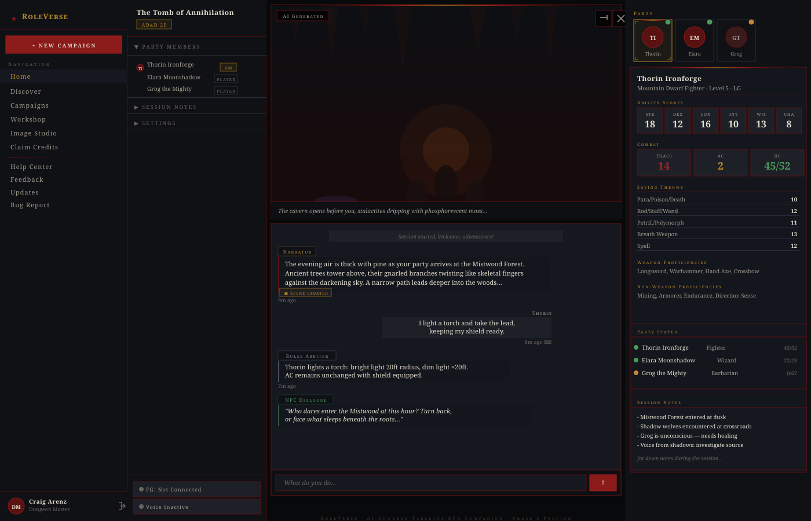

#  RoleVerse - AI-Powered RPG Companion

A tabletop RPG companion that brings **AI-powered DM assistance** and **Fantasy Grounds integration** to your solo RPG campaigns.

## 🖥️ Demo

### Web App
The three-column session layout with sidebar navigation, AI chat with scene display, and character sheet panel.

### Fantasy Grounds Integration
Real-time sync with Fantasy Grounds Unity — combat tracker, character sheets, dice rolls, and battle maps flow seamlessly to the web app.

> [Fantasy Grounds Unity](https://www.fantasygrounds.com) is a virtual tabletop by SmiteWorks. RoleVerse syncs character data, combat state, and dice rolls in real time via a local bridge application.

## ✨ Features

### AI Dungeon Master (5 Specialized Agents)

- **Rules Arbiter**: Knows RPG rules from uploaded PDFs
- **Lore Keeper**: Accesses your campaign knowledge via RAG (queries uploaded PDFs)
- **Encounter Builder**: Creates dynamic encounters and surprises
- **Narrator**: Crafts immersive descriptions and storytelling
- **NPC Dialogue**: Roleplays characters with consistent personalities

### Fantasy Grounds Integration

- **Auto-sync characters** from Fantasy Grounds
- **Real-time combat tracking** iniatiative, HP, attacks, damage, etc.
- **Seamless data flow** between FG and web app
- **Desktop app** for cross-platform integration

### Campaign Management

- Upload your **RPG rulebooks** (PDFs, planned)
- **RAG ingestion** for AI to reference rules
- **Character sheets** synced from Fantasy Grounds
- **Session history** and transcripts
- **NPC Roster** — persistent per-campaign NPCs with disposition and known facts

### Supported Game Systems

- AD&D 1st Edition
- AD&D 2nd Edition
- D&D 3.5
- D&D 4E
- D&D 5E (2014 & 2024)
- Pathfinder 1E & 2E
- Dungeon Crawl Classics
- The One Ring 1E & 2E
- Cyberpunk 2020

## 🏗️ Technology Stack

| Layer          | Technology                       |
| -------------- | -------------------------------- |
| **Frontend**   | Next.js 16 + React 19            |
| **Backend**    | Next.js API Routes (serverless)  |
| **Database**   | PostgreSQL + pgvector            |
| **AI Agents**  | Anthropic Claude                 |
| **Embeddings** | Voyage AI voyage-3-lite          |
| **FG Bridge**  | Desktop sync agent               |
| **Hosting**    | Vercel                           |

## 🚀 Quick Start

Placeholder for user setup instructions. See [SETUP.md](docs/SETUP.md) for full details.

## 📖 Documentation

- **[SETUP.md](docs/SETUP.md)** - Complete user instructions and troubleshooting
- **[ARCHITECTURE.md](./docs/ARCHITECTURE.md)** - System architecture (Mermaid diagram + prose)
- **[WORKSHOP.pdf](./docs/WORKSHOP.pdf)** - Guidelines for RPG resources and contributions

## 📝 License

GNU AFFERO GENERAL PUBLIC LICENSE Version 3

## 🙏 Acknowledgments

- **Anthropic** - Claude AI powers the DM agents and routing
- **Voyage AI** - Embeddings for RAG
- **Supabase** - Database, auth, and storage
- **Vercel** - Hosting and deployment
- **SmiteWorks** - Fantasy Grounds VTT

##  Happy Adventuring!

Build something amazing. Share it with friends. Roll for initiative! ⚔️
