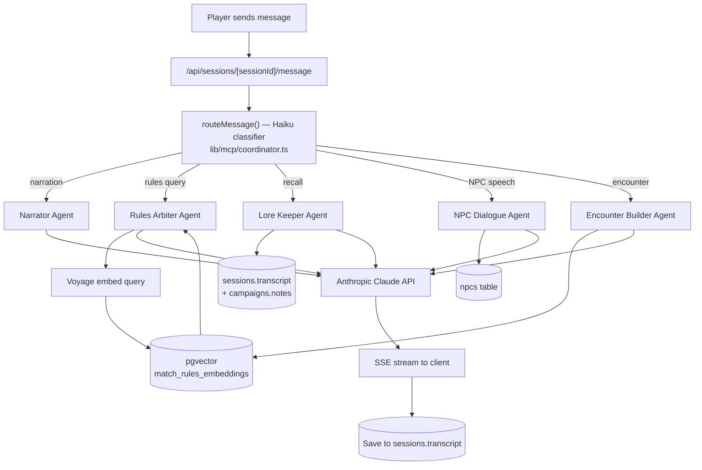

# RoleVerse — Architecture

> This markdown file is the canonical architecture reference. If an `ARCHITECTURE.png`
> exists in the repo, it is deprecated in favor of this document (which can be
> version-controlled and diffed).

## Stack

| Layer | Technology |
|-------|-----------|
<<<<<<< Updated upstream
| **Frontend** | Next.js 16 (App Router, no `src/`), React 19, CSS Modules |
| **Backend** | Next.js API Routes (serverless, Vercel) |
| **Database** | Supabase — PostgreSQL + pgvector + Auth + RLS |
| **AI Agents** | Anthropic Claude API (Sonnet for agents, Haiku for routing) |
| **Embeddings** | Voyage AI (`voyage-3-lite`, 512-dimensional) |
| **Ingestion** | GitHub Actions — manual-trigger workflow per game system |
| **Hosting** | Vercel |
=======
| Framework | Next.js 15 (App Router, no `src/`), React 19, TypeScript |
| Backend | Supabase — PostgreSQL, pgvector, Auth (Google SSO), Row Level Security |
| AI — agents & router | Anthropic Claude API |
| AI — embeddings | Voyage AI (`voyage-3-lite`, 512 dims) |
| Hosting | Vercel |
| Ingestion | GitHub Actions |
| Styling | CSS Modules (per-component `.module.css`) |
| Protocol | MCP server embedded within the Next.js app |
>>>>>>> Stashed changes

Auth is Google OAuth SSO only. Each user's data is isolated at the Postgres level via RLS.

## Request lifecycle



## The orchestrator

The orchestrator does **routing, not coordination**. For each player message:

1. The session message route calls `routeMessage()` in `lib/mcp/coordinator.ts`.
2. That function sends the message plus a disambiguation prompt to Claude Haiku (fast, cheap) and gets back a single classification — which one of the five agents handles this message.
3. Exactly one agent runs. Agents do not call each other. The "multi-agent" experience comes from different messages across a conversation going to different specialists, not from agents collaborating on a single response.

Conversation history is shared across all agents. Each prior assistant message is annotated with an `[Agent Name]` prefix so an agent does not mistake another agent's statements for its own. A cross-agent trust rule in each agent's system prompt establishes that prior agents' statements of campaign fact are canonical and must not be disavowed.

## Per-agent context

| Agent | Context it gathers | Label color |
|-------|-------------------|-------------|
| Narrator | Scene narration + previous session's summary (cross-session continuity) | Gold |
| Rules Arbiter | Voyage-embedded query → `match_rules_embeddings` (pgvector, threshold 0.3, active generation, game-system filtered) → cited SRD chunks | Slate |
| Lore Keeper | `campaigns.notes` + last 5 sessions' transcripts | Purple |
| NPC Dialogue | Campaign NPC roster (disposition, known facts, personality); may emit player-confirmed proposals | Green |
| Encounter Builder | Party composition + monster index from the embeddings | Amber |

## Data layer

Core Postgres tables: `campaigns`, `characters`, `sessions`, `npcs`, `campaign_embeddings`.

- **RAG:** `campaign_embeddings` holds baseline rules chunks (campaign_id NULL) and may hold per-campaign content. pgvector powers similarity search via `match_rules_embeddings`.
- **Generation swap:** baseline embeddings are versioned by a `generation` column with an `embedding_generations` state table, enabling zero-downtime re-ingestion (write new generation, atomically promote, delete old).
- **RLS:** every table is owner-scoped (`auth.uid() = owner_id`) for per-user isolation.
- **NPC roster:** `npcs` per campaign with a 5-value disposition enum and structured `known_facts` JSONB.
- **Sessions:** find-or-create logic (one active session per campaign), transcript persisted per exchange, AI-generated summary on end, summary injected into the Narrator at the next session's start.

## Ingestion

Baseline rules content is ingested via a GitHub Actions workflow (`workflow_dispatch`). The pipeline fetches from source (Open5e for 5E SRD, with `document__slug=wotc-srd` filter), chunks, embeds via Voyage, and writes under a new generation, promoting atomically on success. 5E_2014 has ~2335 chunks. ADD2E and PATHFINDER_2E are stubs (training-knowledge fallback / data deferred).

## Streaming

Agent responses stream to the client via Server-Sent Events:

```
event: agent_type   → which agent is responding (sets label immediately)
event: token        → incremental text chunks
event: proposal     → NPC proposal block (NPC Dialogue only, after narrative)
event: done         → stream complete
```

The route strips NPC proposal sentinel blocks out of the streamed text and emits them as a separate `proposal` event so markers never appear in chat. The full response is accumulated server-side and saved to `sessions.transcript`.

## Fantasy Grounds bridge

Desktop sync from Fantasy Grounds into RoleVerse is complete — FG backup-file parsing maps rulesets to game systems and characters into the app.

## Deferred / planned (not yet built)

- TTS / voice output for NPCs (optional, off-by-default)
- Voice input via browser microphone → Whisper (no Discord)
- PDF ingestion + house rules editor + Lore Keeper semantic search
- Kanka integration for external lore management
- PF2E proper data sourcing

Discord integration was evaluated and **removed from the project** — it is not planned.
