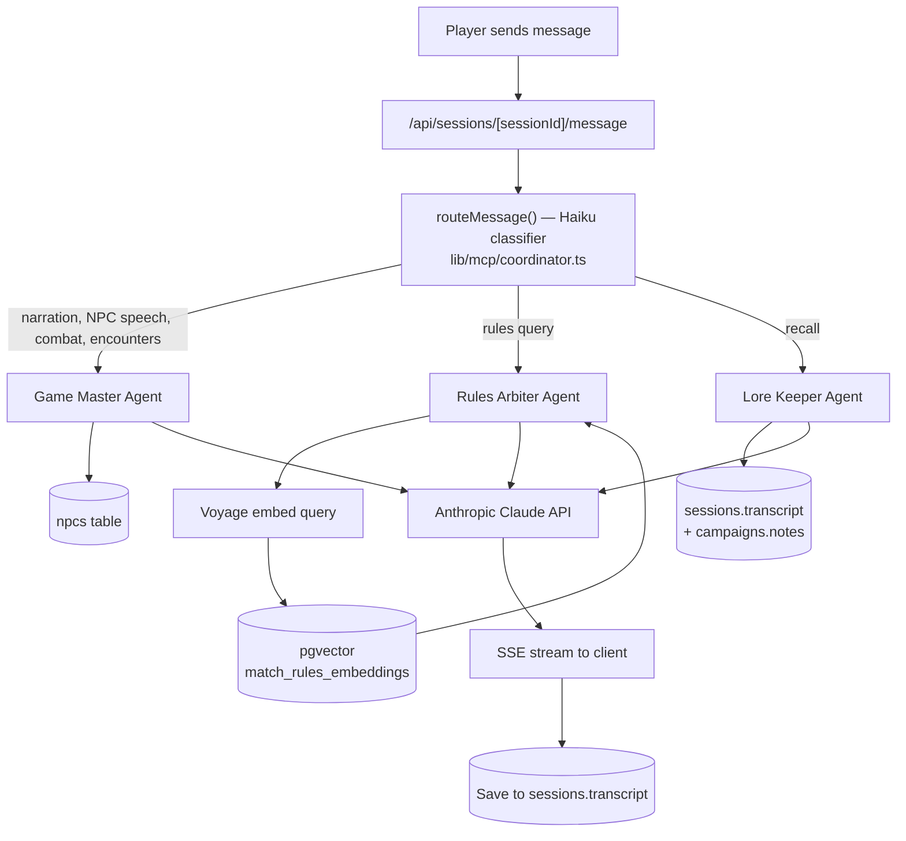

# RoleVerse — Architecture

> This markdown file is the canonical architecture reference.

## Stack

| Layer | Technology |
|-------|-----------|
| **Frontend** | Next.js 16 (App Router, no `src/`), React 19, TypeScript, CSS Modules |
| **Backend** | Next.js Route Handlers (serverless, Vercel) for AI orchestration and admin/ingestion endpoints; campaign/character/session CRUD goes direct through the Supabase client (RLS-enforced), not through API routes |
| **Database** | Supabase — PostgreSQL + pgvector + Auth (Google OAuth) + RLS |
| **AI Agents** | Anthropic Claude API (Sonnet for agents, Haiku for routing) |
| **Embeddings** | Voyage AI (`voyage-3-lite`, 512-dimensional) |
| **Ingestion** | GitHub Actions — manual-trigger workflow per game system |
| **Hosting** | Vercel |

Auth is Google OAuth SSO only. Each user's data is isolated at the Postgres level via RLS.

## Request lifecycle



## The orchestrator

The orchestrator does **routing, not coordination**. For each player message:

1. The session message route calls `routeMessage()` in `lib/mcp/coordinator.ts`.
2. That function sends the message plus a disambiguation prompt to Claude Haiku (fast, cheap) and gets back a single classification — which one of the three agents handles this message.
3. Exactly one agent runs. Agents do not call each other. The "multi-agent" experience comes from different messages across a conversation going to different specialists, not from agents collaborating on a single response.

Conversation history is shared across all agents. Each prior assistant message is annotated with an `[Agent Name]` prefix so an agent does not mistake another agent's statements for its own. A cross-agent trust rule in each agent's system prompt establishes that prior agents' statements of campaign fact are canonical and must not be disavowed.

Despite the `lib/mcp` directory naming, this is **not** the network Model Context Protocol — it's an in-process tool-registration pattern (`registerTool` / `getToolDefinitions` / tool execution in `lib/mcp/server.ts`) used to expose tools like `roll-dice` and `buildEncounter` to the Claude tool-use API.

## Per-agent context

| Agent | Context it gathers | Label color |
|-------|-------------------|-------------|
| Game Master | Present-tense narration, in-the-moment NPC dialogue, combat, encounter building (`buildEncounter` tool); loads party characters, referenced NPC roster records, previous session summary, module description | Gold |
| Rules Arbiter | Voyage-embedded query → `match_rules_embeddings` (pgvector, threshold 0.3, active generation, game-system filtered) → cited SRD chunks | Slate |
| Lore Keeper | `campaigns.notes` + session transcripts — past-tense recall and continuity | Purple |

## Data layer

Core Postgres tables: `campaigns`, `characters`, `sessions`, `npcs`, `campaign_embeddings`.

- **RAG:** `campaign_embeddings` holds baseline rules chunks (campaign_id NULL) and may hold per-campaign content. pgvector powers similarity search via `match_rules_embeddings`.
- **Generation swap:** baseline embeddings are versioned by a `generation` column with an `embedding_generations` state table, enabling zero-downtime re-ingestion (write new generation, atomically promote, delete old).
- **RLS:** every table is scoped to the owning user (`auth.uid()`) for per-user isolation. The owning-user column name is **not** consistent across tables (`user_id` on `campaigns`/`characters`/`sessions`/`campaign_embeddings`, `owner_id` on `npcs`) — check the actual schema before writing a new query.
- **NPC roster:** `npcs` per campaign with a 5-value disposition enum and structured `known_facts` JSONB.
- **Sessions:** find-or-create logic (one active session per campaign), transcript persisted per exchange, AI-generated summary on end, summary injected into the Game Master at the next session's start.

## Character sheets

Fully schema-driven and modular per game system — adding or changing a field never requires touching the generic display, form, or persistence code, only the one file for that system.

- **Storage:** `characters` has four flexible JSONB columns (`game_data_stats`, `game_data_combat`, `game_data_saves`, `game_data_skills`) plus `game_data_custom` for player-added custom fields. No schema migration is needed to add new character-sheet fields — they're just new keys in these JSONB blobs.
- **Schema files** (`lib/character/sheet-schema/{add2e,dnd5e,pf2e,dcc}.ts`): one `SystemSheetSchema` per supported system (`ADD2E`, `5E_2014`, `PATHFINDER_2E`, `DCC`), each a flat list of `SheetField`s. Each field declares a `kind` (`number` | `string` | `string-list` | `record-fixed` | `record-open` | `spell-slots`) and which of the four JSONB columns it belongs to. Field selection mirrors each system's actual mechanical content (ability-derived saves/skills, THAC0, Class DC, thief skills, corruption, etc.) — not any publisher's page layout or artwork, which stays RoleVerse's own visual design throughout.
- **Generic engine, not per-system code:** `BaseSheet.tsx` (display), `SystemFields.tsx` (create/edit form), and `buildGameDataColumns`/`hydrateSystemFieldsValue` (JSONB bucketing) all read the `SheetField[]` array and render/persist generically by `kind` — none of them contain a single per-system conditional. The only per-system exception is two `gameSystem === 'DCC'` branches in `SystemFields.tsx`, for DCC's bespoke Luck/occupation/mercurial-magic inputs that don't fit the generic field kinds — everything else for DCC (saves, thief skills, corruption, patron taint, known spells) is ordinary schema fields.
- **Per-system sheet components** (`components/character/sheets/{ADD2ESheet,DND5ESheet,PF2ESheet,DCCSheet}.tsx`): thin wrappers around `BaseSheet` supplying system-specific header text (race/class/level line) and, where needed, bespoke `extra` sections for content that doesn't fit a generic field kind (PF2E's rank-badge-colored proficiency ranks, DCC's live Luck editor and funnel-party roster). `CharacterSheet.tsx` is the single dispatch point, switching on `gameSystem` to the right component; systems without a structured schema (the SETUP.md "training knowledge only, in development" list — AD&D 1E, 3.5E, 4E, 5E 2024, PF1E, The One Ring 1E & 2E, Cyberpunk 2020) fall through to `GenericSheet.tsx`, a flat dump of whatever's in the JSONB columns.
- **Compact vs. full display:** a `keyStat?: boolean` marker on `number`/`string` fields controls the in-session compact panel (ability scores + HP + `keyStat` fields only — AC everywhere, THAC0 for AD&D 2E, Perception + Hero Points for PF2E). The full sheet (everything) is reachable via a maximize button (`CharacterSheetModal`) from the session view, or directly on the campaign's character detail page.

## Storage

Supabase Storage (S3-backed under the hood — a Storage "bucket" is the same primitive as an S3 bucket, not a lighter abstraction on top of it). Buckets are shared across all users; per-user isolation comes from RLS on `storage.objects` keyed to a `{user_id}/...` folder prefix, not from provisioning a bucket per user or per tenant — that's the standard multi-tenant pattern, and splitting into more buckets would not reduce cost or improve scaling (Supabase bills total GB + egress across the whole project regardless of bucket count).

| Bucket | Access | Path convention | Used by |
|--------|--------|------------------|---------|
| `campaign-pdfs` | Private — RLS restricts both read and write to the owning user's folder | `{user_id}/{campaign_id}/{timestamp}-{filename}` | `CampaignFilesPanel` — upload (PDF, `.txt`, or `.md`, 20MB/file) / list / delete, auto-indexed into `campaign_embeddings` immediately on upload (see RAG below). 25MB per campaign. |
| `campaign-scenes` | Public read, RLS-restricted write | `{user_id}/{campaign_id}/{timestamp}-{filename}` | `CampaignScenesPanel` (photo library — **images only**, video was considered and deliberately dropped: a single large video would disproportionately eat the per-campaign/Free-tier budget for one asset) + `ScenePickerModal` (attach one as the active in-session scene). 5MB/file, 25MB per campaign. |
| `campaign-covers` | Public read, RLS-restricted write | `{user_id}/{campaign_id}/cover.jpg` | Campaign card thumbnails (`EditCampaignPage`, `CampaignsListPage`) — client-side resized to a 1024×1024 JPEG before upload, 5MB source-file cap |
| `character-avatars` | Public read, RLS-restricted write | `{user_id}/...` | Provisioned in the initial schema; not yet wired to any UI |

Public buckets mean anyone with the direct file URL can view it without authentication (same model as most apps' avatar/thumbnail URLs) — appropriate since these images aren't sensitive. Writes stay RLS-gated to the owning user's folder regardless of a bucket's public/private read setting.

**Per-campaign storage caps** (`lib/storage/check-quota.ts`'s `assertWithinQuota`, used by both `CampaignFilesPanel` and `CampaignScenesPanel`): enforced **client-side only**, matching the existing per-file caps' enforcement level — there's no server-side upload route for any bucket today (all uploads go browser→Storage directly via the client SDK), so server-side-only aggregate enforcement while per-file caps stay client-side would be an inconsistent asymmetry, not a real security improvement. Same known gap as the per-file caps: bypassable by a modified client. A bucket-level size/MIME-type limit in the Supabase dashboard, or a real upload-proxy route, would close this as defense-in-depth if it ever matters.

Numbers were set against the **Free plan's 1GB total, project-wide** storage ceiling (verified against Supabase's own pricing page, not a secondary source) — a 50MB combined ceiling per campaign (25MB modules + 25MB scenes) means roughly 20 campaigns' worth of fully-maxed usage before the whole project needs a Pro upgrade, without making the features too cramped to actually use (a typical module PDF is 5-20MB; a handful of 5MB-or-under photos covers most scene libraries). This isn't a hard mathematical guarantee against every campaign maxing out simultaneously — that would require caps small enough to make the features nearly useless — it's realistic-case headroom with a bounded worst case, the same "worst-case ceiling vs. realistic average" framing used for the cost table below.

**Known gaps, not yet built:**
- Deleting a campaign does not cascade-delete its Storage files — Postgres row deletes don't automatically remove Storage objects, so orphaned files accumulate today. A natural fit for the Tier 2.1 rate-limiting work on the roadmap when prioritized, not blocking for current usage.

**Storage cost, Free vs. Pro** (verified directly against Supabase's pricing page — an earlier $0.125/GB figure from a secondary source was wrong):
- **Free (current plan): 1GB file storage, hard cap, project-wide** — not per-campaign, not per-bucket. No paid overage on Free; Supabase emails a warning approaching the limit, then blocks new uploads once hit (not silent billing). This is the actual near-term constraint, well ahead of any per-campaign cap above.
- **Pro: $25/month, 100GB file storage included, $0.0213/GB/month overage.**

| Campaigns | Worst-case (both caps maxed, 50MB/campaign) | Cost | Realistic (~5MB/campaign avg, this project's own estimate) | Cost |
|---|---|---|---|---|
| 50 | 2.5GB | $25 (within 100GB) | 250MB | $25 |
| 200 | 10GB | $25 | 1GB | $25 |
| 1,000 | 50GB | $25 | 5GB | $25 |
| 5,000 | 250GB | ~$28.20 | 25GB | $25 |

At these cap sizes, cost stays flat at the $25 Pro base through thousands of campaigns even in the worst case — the caps function purely as a per-campaign abuse guard, not a real cost lever at any scale worth planning around yet.

## Ingestion

Baseline rules content is ingested via a GitHub Actions workflow (`workflow_dispatch`) — the only trigger path. It requires GitHub write access to the repo, which is the actual access boundary (not anything in application code). The pipeline fetches from source (Open5e for 5E SRD, with `document__slug=wotc-srd` filter), chunks, embeds via Voyage, and writes under a new generation, promoting atomically on success. 5E_2014 has ~2335 chunks. ADD2E and PATHFINDER_2E are stubs (training-knowledge fallback / data deferred).

An in-app `/admin` page + `POST /api/admin/ingest` existed as a second trigger path (gated by an `ADMIN_EMAILS` env var allowlist) and was removed — GitHub Actions already covered the need, and the app-side gate had a fail-open bug (`adminEmails.length > 0 && !includes(...)` grants access to *everyone* if `ADMIN_EMAILS` is ever unset, rather than denying). Removing the redundant path removed the bug along with it, rather than patching a check that shouldn't have existed as a second privileged surface in the first place.

**When an admin page would earn its place again:** nothing in the current architecture needs one. The natural trigger point is Tier 2 monetization (credits/subscriptions) — looking up a user's credit balance or subscription state for a support request, manually adjusting a balance, or seeing who hasn't accepted an updated ToS are genuine admin tasks that don't fit any existing player-facing UI. Until then, Supabase's own dashboard covers the rare cases where direct data access is needed. If one is built, keep it scoped to that actual need rather than growing back into a general ingestion/ops console — and gate it fail-closed (deny by default, allow only on an explicit match) rather than repeating this bug's shape.

**Campaign content ingestion:** a player-uploaded PDF/`.txt`/`.md` file is indexed automatically immediately after upload (`CampaignFilesPanel`, no separate "index" step) via `POST /api/campaigns/[id]/modules/ingest` (`lib/rag/ingest-campaign-pdf.ts`). This reuses the baseline pipeline's building blocks (`chunkText`, `embedBatch`) but is a separate, simpler orchestrator — no generation-swap, writes go through the request-scoped RLS-protected client rather than the service-role client, since `campaign_embeddings`' insert policy already permits `campaign_id IS NOT NULL AND auth.uid() = user_id` (added in `20260301000000_rag_phase_6a.sql`, which also added the `user_pdf` `source_type` — this feature was schema-ready well before it was built). Text extraction branches on file type: `.pdf` goes through `pdf-parse-fork` (a dependency that predates this feature, previously unused); `.txt`/`.md` is read directly as UTF-8, no parsing needed.

**Campaign-specific content is treated as authoritative, not just "reference material"** — a deliberate two-axis framing applied everywhere this content is injected: (1) it can never redirect the AI's behavior/instructions (standard injection defense), and (2) it *is* the canonical answer within its domain, superseding baseline SRD text or the model's generic training knowledge when they conflict — the same posture this project's own CLAUDE.md takes ("these instructions OVERRIDE default behavior"). This requires guaranteed retrieval, not just prompt wording: `match_rules_embeddings` unions baseline (`campaign_id IS NULL`) and campaign-scoped rows into *one* ranked pool, so a campaign-specific chunk can lose its slot to an unrelated but higher-scoring baseline chunk — wording alone can't fix that, since the content might not even be retrieved. `match_campaign_priority_embeddings` (`20260808000000_match_campaign_priority_embeddings.sql`) is a separate function scoped to a single campaign's own rows only (parameterized by `source_types TEXT[]`, no baseline union, no `game_system` filter needed), so this content only ever competes against other rows from the *same* campaign:

- **Game Master** (`lib/mcp/agents/game-master.ts`) calls it with `['user_pdf']` on every turn (the player's message is the query), formatted as a new "## Uploaded Module Reference" system-prompt block — grounds narration (rooms, NPCs, plot) in the actual uploaded text instead of just the model's general memory of the module.
- **Rules Arbiter** (`lib/mcp/agents/rules-arbiter.ts`) calls it the same way, as a new "## This Campaign's Rules Overrides" block positioned *before* its existing baseline-mixed "## Retrieved Rules Context" block, with explicit instruction that this section wins on conflict.
- **Lore Keeper does not need this mechanism** — verified by reading `lore-keeper.ts` directly: it already reads `campaigns.notes` + `sessions.transcript` exclusively (no `campaign_embeddings`/baseline content mixed in at all), and its system prompt already says campaign notes/transcripts are the *only* canonical source for past-session questions. Nothing for player-introduced lore to lose priority to.
- A **house-rules editor UI was considered and dropped**: since any upload already gets this same guaranteed-retrieval/priority treatment, a player can upload a house-rules `.txt`/`.md`/`.pdf` the same way they'd upload a module — no dedicated editor needed. `source_type = 'house_rule'` remains an allowed-but-unused value in the `campaign_embeddings` CHECK constraint, not a feature to build toward.

Because this pipes arbitrary user-uploaded text into context blocks agents treat as authoritative, both the Rules Arbiter's existing "## Retrieved Rules Context" block and the new blocks above carry explicit prompt-injection framing, matching the pattern the Game Master already uses for `module_description`.

## Streaming

Agent responses stream to the client via Server-Sent Events:

```
event: agent_type   → which agent is responding (sets label immediately)
event: token        → incremental text chunks
event: error        → stream failed; any partial content is persisted with a "[truncated]" marker
event: done         → stream complete
```

The full response is accumulated server-side and saved to `sessions.transcript`.

NPC roster entries are not proposed inline during chat. A player or GM explicitly triggers **Extract NPCs** on a session, which parses the transcript (`lib/sessions/extract-npcs.ts`) and surfaces proposals for approval in the NPC roster UI.

## Fantasy Grounds bridge

Desktop sync from Fantasy Grounds into RoleVerse is complete — FG backup-file parsing maps rulesets to game systems and characters into the app.

## Deferred / planned (not yet built)

- TTS / voice output for NPCs (optional, off-by-default) — still open, needs a real decision (voice selection, autoplay, cost/UX) before building
- ~~Voice input transcription~~ — **done, not deferred.** RoleVerse was never going to build its own STT pipeline; players use their browser/OS's native voice-to-text to dictate into the chat input, entirely outside the app. `VoiceStatus` (a real `getUserMedia` permission toggle, captures/sends nothing) is the only piece RoleVerse owns here, and it's shipped.
- Uploaded content feeds the Game Master and Rules Arbiter (see "Campaign content ingestion" above) — the Lore Keeper still doesn't do RAG search at all (it reads `campaigns.notes` + transcripts directly, and doesn't need to — see above). A dedicated house-rules editor was considered and dropped, not deferred — uploads already get the same priority treatment.
- ~~On-demand AI scene generation~~ — **removed, not deferred.** Not a planned feature. The scene asset library (upload/attach photos, images only — video was considered and dropped, see Storage) is the whole feature; there's no plan to generate new images on demand.
- Kanka integration for external lore management
- PF2E proper data sourcing
