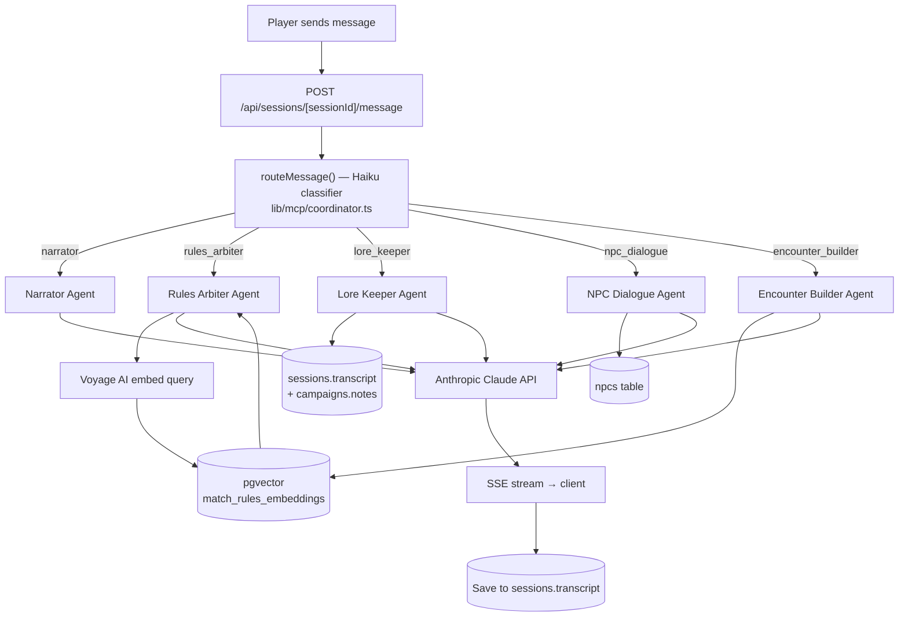

# RoleVerse — Architecture

> **Canonical reference:** This Markdown file is the authoritative architecture document.
> `ARCHITECTURE.png` (if present in this directory) is deprecated and may be out of date.

---

## Stack Overview

| Layer | Technology |
|-------|-----------|
| **Frontend** | Next.js 16 (App Router, no `src/`), React 19, CSS Modules |
| **Backend** | Next.js API Routes (serverless, Vercel) |
| **Database** | Supabase — PostgreSQL + pgvector + Auth + RLS |
| **AI Agents** | Anthropic Claude API (Sonnet for agents, Haiku for routing) |
| **Embeddings** | Voyage AI (`voyage-3-lite`, 512-dimensional) |
| **Ingestion** | GitHub Actions — manual-trigger workflow per game system |
| **Hosting** | Vercel |

Auth is Google OAuth SSO only (via Supabase Auth). No email/password, no third-party bots or integrations.

---

## Request Lifecycle



---

## The Orchestrator

The architecture is **routing, not coordination**. The Haiku classifier in `lib/mcp/coordinator.ts` picks exactly **one** agent per player message. Agents do not call each other or share state mid-message. The multi-specialist feel comes from different messages going to different agents over the course of a session.

Conversation history is shared across all agents and annotated with `[Agent Name]` prefixes, so each agent can see what prior agents said without mistaking another agent's statement for its own.

If the Haiku API call fails or returns an unexpected value, `routeMessage()` falls back to keyword matching — the system degrades gracefully without crashing.

---

## Per-Agent Context

| Agent | What it pulls in |
|-------|-----------------|
| **Narrator** | Scene state; prior-session summary injected into system prompt |
| **Rules Arbiter** | Voyage AI embedding of the query → pgvector similarity search on `campaign_embeddings` |
| **Lore Keeper** | Session transcripts (`sessions.transcript`) + `campaigns.notes` |
| **NPC Dialogue** | `npcs` table for the current campaign (disposition, location, known_facts) |
| **Encounter Builder** | Party composition; pgvector monster/encounter index |

---

## Data Layer

### Supabase Tables

| Table | Purpose |
|-------|---------|
| `campaigns` | Campaign metadata, game system ID, owner, notes |
| `characters` | Character sheets — JSON schema varies by game system |
| `sessions` | Session records — transcript (JSONB array), start/end timestamps |
| `npcs` | Per-campaign NPC roster — disposition enum, location, known_facts |
| `campaign_embeddings` | pgvector embeddings with generation tag for zero-downtime re-ingestion |

### pgvector RAG

- Embedding model: Voyage AI `voyage-3-lite` (512 dimensions)
- Similarity operator: `operator(extensions.<=>)` (cosine distance)
- Match threshold: `0.3`
- Match function: `match_rules_embeddings` — no `embedding_generations` JOIN; generation filtering is handled in application code
- Zero-downtime re-ingestion: generation swap pattern — new generation written in full, then old generation dropped atomically

### Row-Level Security

All tables enforce per-user isolation via RLS policies. `SECURITY DEFINER` helper functions break RLS recursion where needed (e.g., campaign membership checks). The Supabase anon key is intentionally exposed in the browser — RLS is the enforcement layer.

---

## Ingestion Pipeline

1. **Trigger** — GitHub Actions `ingest-rules.yml` (manual `workflow_dispatch`), one system at a time: `5E_2014`, `ADD2E`, or `PATHFINDER_2E`.
2. **Script** — `scripts/run-ingestion.ts` (called by the workflow via `npx tsx`).
3. **Fetchers** (`lib/rag/fetchers/`) — system-specific data sources:
   - `open5e.ts` — Open5e REST API for D&D 5E 2014 SRD (~2,335 chunks)
   - `osric.ts` — OSRIC stub for AD&D 2E (training-knowledge fallback; no clean machine-readable SRD found)
   - `pf2e.ts` — Foundry VTT PF2E compendium data (data sourced; full ingestion deferred)
4. **Chunking** — `lib/rag/chunk.ts` splits content into embedding-ready segments.
5. **Embedding** — `lib/rag/embed.ts` calls Voyage AI API.
6. **Upsert** — chunks written to `campaign_embeddings` under a new generation value.
7. **Generation swap** — old generation dropped; new generation goes live. Zero downtime.

---

## Streaming — SSE Protocol

The session message route (`app/api/sessions/[sessionId]/message/route.ts`) streams the agent response as Server-Sent Events:

```
event: agent_type
data: "narrator"

event: token
data: "The"

event: token
data: " tavern door swings open..."

event: done
data: {}
```

An NPC Dialogue response may also emit a `proposal` event before `done` when the agent proposes adding or updating an NPC in the campaign roster.

---

## Fantasy Grounds Bridge

A companion desktop sync agent bridges Fantasy Grounds Unity to RoleVerse, syncing characters, combat state, and dice rolls in real time. The bridge is complete. A user-facing setup guide for the desktop sync agent is coming soon.

---

## Deferred / Planned

| Feature | Status |
|---------|--------|
| Voice input (browser mic → Whisper STT) | Planned — Batch 4, optional, off by default |
| PF2E full data ingestion | Planned — data sourced, ingestion deferred |
| AD&D 2E full RAG beyond OSRIC stub | Planned — no clean machine-readable SRD found |
| User PDF upload (custom rulebooks) | Planned |
| Session log improvements (pagination, AI summary, search) | Deferred |
