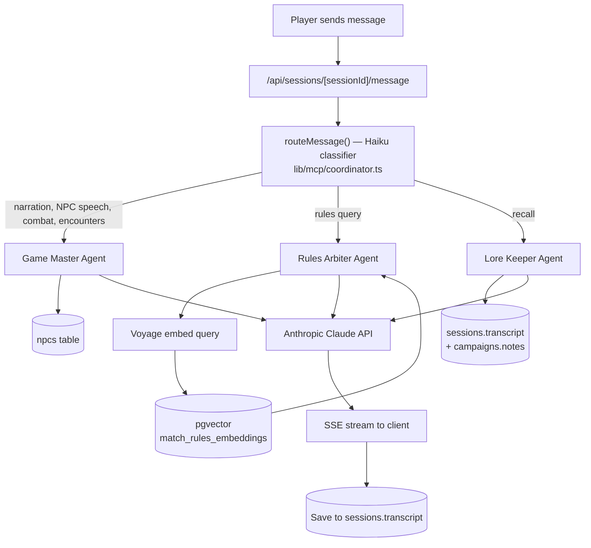

# RoleVerse — Architecture

> This markdown file is the canonical architecture reference.

## Stack

| Layer | Technology |
|-------|-----------|
| **Frontend** | Next.js 16 (App Router, no `src/`), React 19, TypeScript, CSS Modules |
| **Backend** | Next.js Route Handlers (serverless, Vercel) for AI orchestration and admin/ingestion endpoints; campaign/character/session CRUD goes direct through the Supabase client (RLS-enforced), not through API routes |
| **Database** | Supabase — PostgreSQL + pgvector + Auth (Google OAuth) + RLS |
| **AI Agents** | Anthropic Claude API (Sonnet for agents, Haiku for routing) |
| **Embeddings** | Voyage AI (`voyage-3-lite`, 512-dimensional) |
| **Ingestion** | GitHub Actions — manual-trigger workflow per game system |
| **Hosting** | Vercel |

Auth is Google OAuth SSO only. Each user's data is isolated at the Postgres level via RLS.

## Request lifecycle



## The orchestrator

The orchestrator does **routing, not coordination**. For each player message:

1. The session message route calls `routeMessage()` in `lib/mcp/coordinator.ts`.
2. That function sends the message plus a disambiguation prompt to Claude Haiku (fast, cheap) and gets back a single classification — which one of the three agents handles this message.
3. Exactly one agent runs. Agents do not call each other. The "multi-agent" experience comes from different messages across a conversation going to different specialists, not from agents collaborating on a single response.

Conversation history is shared across all agents. Each prior assistant message is annotated with an `[Agent Name]` prefix so an agent does not mistake another agent's statements for its own. A cross-agent trust rule in each agent's system prompt establishes that prior agents' statements of campaign fact are canonical and must not be disavowed.

Despite the `lib/mcp` directory naming, this is **not** the network Model Context Protocol — it's an in-process tool-registration pattern (`registerTool` / `getToolDefinitions` / tool execution in `lib/mcp/server.ts`) used to expose tools like `roll_dice` and `buildEncounter` to the Claude tool-use API.

## Per-agent context

| Agent | Context it gathers | Label color |
|-------|-------------------|-------------|
| Game Master | Present-tense narration, in-the-moment NPC dialogue, combat, encounter building (`buildEncounter` tool); loads party characters, referenced NPC roster records, previous session summary, module description | Gold |
| Rules Arbiter | Voyage-embedded query → `match_rules_embeddings` (pgvector, threshold 0.3, active generation, game-system filtered) → cited SRD chunks | Slate |
| Lore Keeper | `campaigns.notes` + session transcripts — past-tense recall and continuity | Purple |

## Data layer

Core Postgres tables: `campaigns`, `characters`, `sessions`, `npcs`, `campaign_embeddings`.

- **RAG:** `campaign_embeddings` holds baseline rules chunks (campaign_id NULL) and may hold per-campaign content. pgvector powers similarity search via `match_rules_embeddings`.
- **Generation swap:** baseline embeddings are versioned by a `generation` column with an `embedding_generations` state table, enabling zero-downtime re-ingestion (write new generation, atomically promote, delete old).
- **RLS:** every table is scoped to the owning user (`auth.uid()`) for per-user isolation. The owning-user column name is **not** consistent across tables (`user_id` on `campaigns`/`characters`/`sessions`/`campaign_embeddings`, `owner_id` on `npcs`) — check the actual schema before writing a new query.
- **NPC roster:** `npcs` per campaign with a 5-value disposition enum and structured `known_facts` JSONB.
- **Sessions:** find-or-create logic (one active session per campaign), transcript persisted per exchange, AI-generated summary on end, summary injected into the Game Master at the next session's start.

## Ingestion

Baseline rules content is ingested via a GitHub Actions workflow (`workflow_dispatch`). The pipeline fetches from source (Open5e for 5E SRD, with `document__slug=wotc-srd` filter), chunks, embeds via Voyage, and writes under a new generation, promoting atomically on success. 5E_2014 has ~2335 chunks. ADD2E and PATHFINDER_2E are stubs (training-knowledge fallback / data deferred).

## Streaming

Agent responses stream to the client via Server-Sent Events:

```
event: agent_type   → which agent is responding (sets label immediately)
event: token        → incremental text chunks
event: error        → stream failed; any partial content is persisted with a "[truncated]" marker
event: done         → stream complete
```

The full response is accumulated server-side and saved to `sessions.transcript`.

NPC roster entries are not proposed inline during chat. A player or GM explicitly triggers **Extract NPCs** on a session, which parses the transcript (`lib/sessions/extract-npcs.ts`) and surfaces proposals for approval in the NPC roster UI.

## Fantasy Grounds bridge

Desktop sync from Fantasy Grounds into RoleVerse is complete — FG backup-file parsing maps rulesets to game systems and characters into the app.

## Deferred / planned (not yet built)

- TTS / voice output for NPCs (optional, off-by-default)
- Voice input via browser microphone → Whisper
- PDF ingestion + house rules editor + Lore Keeper semantic search
- Kanka integration for external lore management
- PF2E proper data sourcing
